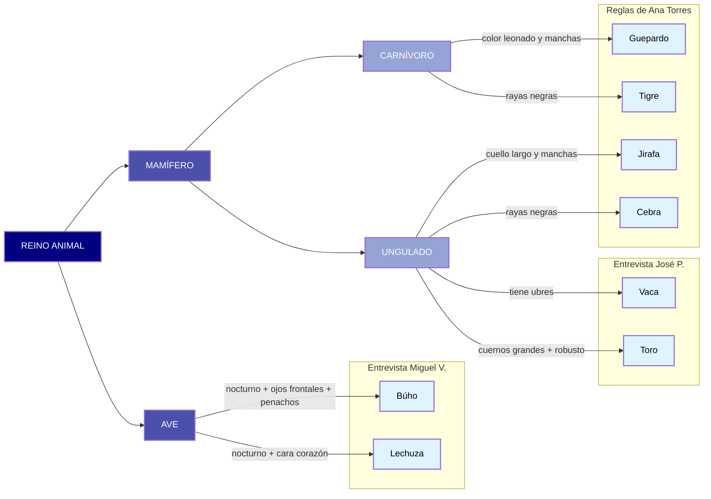

```mermaid
graph LR
   %% Estilos de los nodos
    classDef raiz fill:#000080,stroke-width:2px,color:#fff;
    classDef clasePrincipal fill:#4B51AA,stroke-width:2px,color:#fff;
    classDef subclase fill:#95A3D5,stroke-width:2px,color:#fff;
    classDef especie fill:#E0F4FF,stroke-width:2px,color:#000;

    %% Raíz
    Reino[REINO ANIMAL]:::raiz

    %% Clases Principales
    Reino --> Mamifero[MAMÍFERO]:::clasePrincipal
    Reino --> Ave[AVE]:::clasePrincipal

    %% Subclases y Reglas de Ana Torres
    Mamifero --> Carnivoro[CARNÍVORO]:::subclase
    Mamifero --> Ungulado[UNGULADO]:::subclase
    
    Carnivoro -->|color leonado y manchas| Guepardo[Guepardo]:::especie
    Carnivoro -->|rayas negras| Tigre[Tigre]:::especie
    
    Ungulado -->|cuello largo y manchas| Jirafa[Jirafa]:::especie
    Ungulado -->|rayas negras| Cebra[Cebra]:::especie

    %% Reglas de Miguel V. (Entrevista Miguel)
    Ave -->|nocturno + ojos frontales + penachos| Buho[Búho]:::especie
    Ave -->|nocturno + cara corazón| Lechuza[Lechuza]:::especie

    %% Reglas de José P. (Entrevista José)
    Ungulado -->|tiene ubres| Vaca[Vaca]:::especie
    Ungulado -->|cuernos grandes + robusto| Toro[Toro]:::especie

    %% Leyenda de Autores integrada de forma limpia
    subgraph Ana [Reglas de Ana Torres]
        Guepardo
        Tigre
        Jirafa
        Cebra
    end

    subgraph Miguel [Entrevista Miguel V.]
        Buho
        Lechuza
    end

    subgraph Jose [Entrevista José P.]
        Vaca
        Toro
    end
```
Se corrigió la estructura del árbol de decisión conectando los nodos Vaca y Toro a la subclase UNGULADO en lugar de MAMÍFERO ya que investigando me di cuenta que si entran en esta categoria.